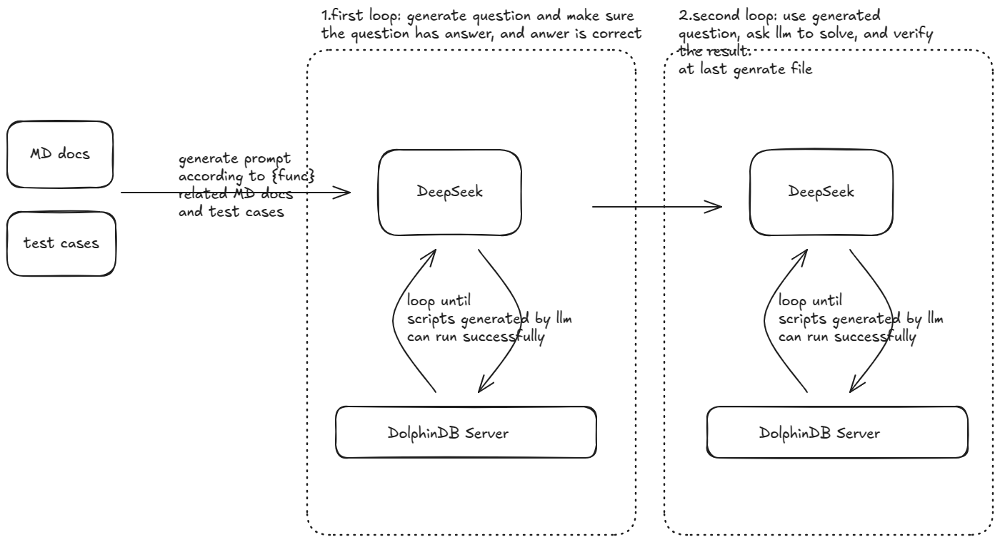

## 基本原理




- 所有过程让llm来做，接入llm和dolphindb，dolphindb server用来判断llm生成的代码能否运行（目前能运行就当正确）

- 对于生成函数数据标注文件的任务，会先清洗下html文本（存放在./docs目录下），转为txt的文本（存放在./cleandocs目录下）。之后针对整个函数生成是，会读取这个清洗后的文本再去贴到prompt里

- 里面有2次循环，第一次循环，是让大模型根据资料提出问题，并给出答案，之后进行验证。确认有问题，有解之后，再切换提示词（这里更像人工标注数据的过程），带上上一步的问题，来让llm再来解决问题，之后再次通过dolphindb server来运行代码验证。

- 如果中途出错，会带着错误信息来返回给大模型让其修正（后续如果parser的报错能够友好一些就好了）。目前看报错不太好，如果第一次模型写错了，带着报错也基本上修复不好


## 项目文件说明

### `data_cleaner.py`
- **功能**: 清洗HTML文件并将其转换为TXT格式。
- **描述**: 该脚本用于处理HTML文件，去除不必要的标签和格式，提取纯文本内容，并将其保存为TXT文件。

### `data_dstiller.py`
- **功能**: 运行后生成标注文件并提交。
- **描述**: 该脚本用于从清洗后的数据中提取关键信息，生成标注文件，并自动提交到指定的目标位置。

### `cot_review.py`
- **功能**: 尝试修改COT（Chain of Thought），使其更加符合要求。
- **描述**: 该脚本用于审查和修改COT（Chain of Thought）逻辑，确保其更加符合项目需求，并提升整体效果。


## 使用说明

### 1.申请deepseek API
可以使用火山方舟或者硅基流动的，需要付费

### 2.配置环境变量

``` shell
cp .env.example .env
```

需要设置里面的参数。
- deepseek的相关参数，用来调用模型。
- dolphindb的相关参数，用来连上dolphindb server来做代码验证（验证deepseek的代码可以正常run）


### 3.准备文档

可以参考 `data_cleaner.py`，修改main函数里的functions变量，添加需要处理的文档

运行`data_dstiller.py`，生成数据标注文件（在./data目录下）。需要修改main函数里的functions，来添加需要处理的函数

### 4.一些注意点

- 数据清洗时，可能一些函数原始的html文件找不到，这时候可以特殊处理，主要参考 file_manager.py里的find_function_html_file 函数。
- 有一些函数，可能大模型会写不对，这时候可以修改下prompt.py里的question_prompt_distinct 或者 question_prompt 来修改提示。这两个提示词生成函数的区别在于，第一个会带上已有生成的问题和答案，提示模型不要生成相同的（可能没有必要，多跑几次也可以）